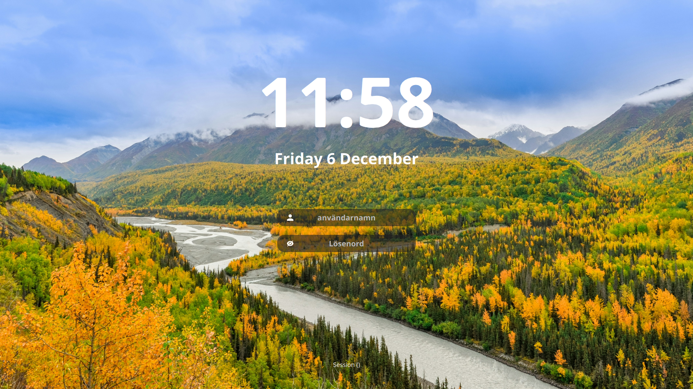

# sddm-alaska-theme based on sddm-astronaut-theme

A theme for the [SDDM login manager](https://github.com/sddm/sddm).

- Screen resolution: 1080p
- Font: Open sans

### Preview

You can easily change how it looks in **[config](./Themes/theme1.conf)**. 
Here are some examples:



### Dependencies

#### Arch, Void
```sh
sddm qt6-svg
```
#### Fedora
```sh
sddm qt6-qtsvg
```
#### OpenSUSE
```sh
sddm-qt6 qt6-svg
```

### Install

1. Clone this repository, copy fonts to `/usr/share/fonts/`:

   ```sh
   sudo git clone https://github.com/Dequilla/sddm-alaska-theme.git /usr/share/sddm/themes/sddm-alaska-theme
   sudo cp /usr/share/sddm/themes/sddm-alaska-theme/Fonts/* /usr/share/fonts/
   ```

2. Then edit `/etc/sddm.conf`, so that it looks like this:

    ```sh
    echo "[Theme]
    Current=sddm-alaska-theme" | sudo tee /etc/sddm.conf
    ```


### Virtual keyboard


#### Arch
1. Install package.
    ```sh
    sddm qt6-virtualkeyboard
    ```

2. Then edit `/etc/sddm.conf.d/virtualkbd.conf`, so that it looks like this:

    ```sh
    [General]
    InputMethod=qtvirtualkeyboard
    ```

### Credits
sddm-alaska-theme is based on sddm-astronaut-theme which in turn is based on Sugar Dark for SDDM.
- [`Astronaut theme for SDDM`](https://github.com/Keyitdev/sddm-astronaut-theme) by **Keyitdev**.
- [`Sugar Dark for SDDM`](https://github.com/MarianArlt/sddm-sugar-dark) by **MarianArlt**.

### License

Distributed under the **[GPLv3+](https://www.gnu.org/licenses/gpl-3.0.html) License**.    
Copyright (C) 2022-2024 Keyitdev.

#### Backgrounds
Backgrounds are retrieved from unsplash.com using only images licensed with their free license. Following are the copyright holders:
- https://unsplash.com/@rodlong
- https://unsplash.com/@zetong
- https://unsplash.com/@gracegonewild
- https://unsplash.com/@jwheeler5759
- https://unsplash.com/@funkmastacrump
- https://unsplash.com/@joshuas
- https://unsplash.com/@vshashkov
